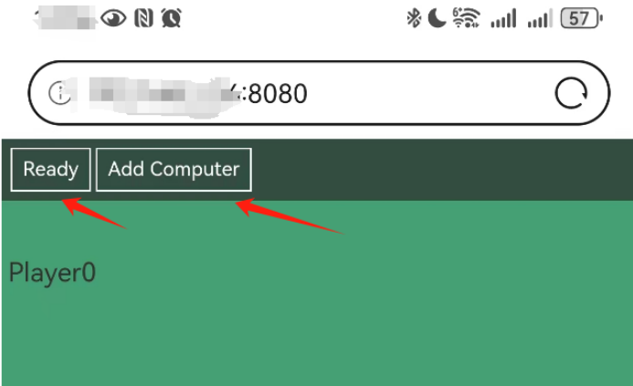
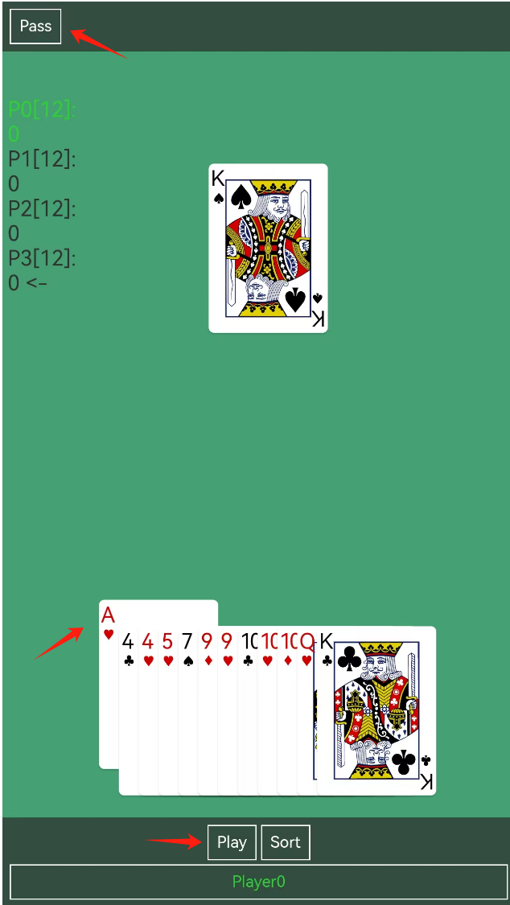

# BCards
A game of poker.

## Base Rules
* At least 2 players and at most 4 players.
* Every player has 13 cards at first.
* The winner is the player which play all the 13 cards out.
* When one play out all the 13 cards, record and accumulate
  the number of cards of the other players as the score.
  * Double the number if more than 10.
  * Triple the number if equal 13.
* The game end while one's score reach 100. The final winner
  is the player with least score.

## Play Rules
* Which player play first?
  * at the first time the player with the weakest card play first.
  * after the first time the player which win the game last time
    play first.
* How to play?
  * if there's no pre*player, or the pre*player is yourself, you 
    can play any type of cards.
  * if there's pre*player, you must play the same type of cards,
    and your play*cards must power than the pre*cards.
* What's the type of cards?
  * You can play at most 5 cards once.
  * The number of play*cards is the type of it.
  * If the number less than 5, the cards should be the same value.
  * If the number equal 5, it can be Straight, Flush, FlushStraight,
    FullHouse and Quads.
* What's the power of cards?
  * the power ranking of card value:
    3 < 4 < 5 < ... < 10 < J < Q < K < A < 2
  * the power ranking of card suit:
    diamonds < clubs < hearts < spades
  * the power ranking of 5*cards:
    Straight < Flush < FullHouse(3+2) < Quads(4+1) < FlushStraight

## Deploy
* Install Python3 env.
  * You can get Python3 from [here](https://www.python.org/downloads/).
* Install dep*pkgs.
  * `pip3 install *r requirements.txt`

## Run the Game
* Start the Server on PC.
  * `python3 start.py`
* Check the localhost ip.
  * Windows: `ipconfig /all`
  * Linux/Mac: `ifconfig`
* Join the Game from Phone or PC.
  * Open Browser and type the website: `http://{localhost ip}:8080`

## Play the Game
* Press `Add Computer` to add computers or wait other players join.
  * 
* After all the players are ready, press `Ready` to start the game.
  * 
* Select cards you want to play and press `Play` or `Pass` just turn to the next player.